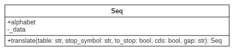
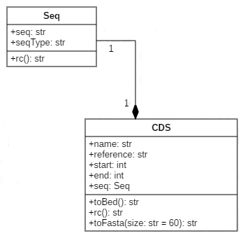

# Initiation POO Python

## Introduction

Pour cette première approche de la programmation objet en Python, nous allons principalement faire de la revue de code et une implémentation naive d'un petit use case. Le but principal de cette première session est de s'inspirer de code existant dans le but de comprendre la logique de développement et la modularité qu'apporte une conception objet. 

## Revue de code : Bio.Seq.py

Pour rester proche du monde de la bioinformatique, nous allons regarder le package BioPython et plus particulièrement la classe Seq pour commencer. Le code de cette classe est disponible [ici](https://github.com/biopython/biopython/blob/master/Bio/Seq.py). Comme vous allez très vite le constater cette classe est très grande. Son rôle premier est de stocker des informations de séquence, mais elle est capable de faire plus comme par exemple des traitements de type traduction en proteine. Ces traitements peuvent se faire via des appels à ce que l'on nomme des "méthodes", ce qui est l'équivalent des "fonctions" pour les modules. Ci-dessous une première extraction du code de la classe.

### Bio.Seq.py - extrait 1

```
class Seq(object):
    """Read-only sequence object (essentially a string with an alphabet)."""
    ...

    def __init__(self, data, alphabet=Alphabet.generic_alphabet):
        """Create a Seq object."""
        ...

    def translate(self, table="Standard", stop_symbol="*", to_stop=False,
                  cds=False, gap=None):
        """Turn a nucleotide sequence into a protein sequence by creating a new Seq object."""
        ...
```


Ce que l'on peut d'ores et déjà remarquer, c'est la facilité de compréhension du code. Même sans connaissance a priori de la syntaxe objet Python, on comprend tout de suite, que grace au mot `class`, on va commencer l'implementation d'une classe qui s'apellera `Seq` et qui sera construite sur la base d'un type appelé `object`. La spécification du type `object` ou non, a une influence seulement sur la version 2 de Python. Sans rentrer dans les détails, ceci permettra d'avoir ou non des classes de nouveau ou de vieux style. Dans le cas de Python 3, toutes les classes sont de nouveau style, il y n'y a donc aucune obligation de spécifié `object`. Nous reviendrons plus tard sur les types de classes, notamment quand nous aborderons l'héritage.

Nous avons ensuite une méthode `__init__`, qui comme on peut le supposer sert à l'initiation de la classe. Plus précisement, cette méthode va servir à instancier des objets du type de la classe `Seq`.

De même une classe peut avoir une méthode `__del__` qui sera appelée lorsque l'objet sera détruit. Par défaut, il n'est pas souvent nécéssaire d'implementer le destructeur de la classe, mais si vous souhaitez déclencher une action lorsqu'un objet est détruit cela peut être intéressant.

Comme on peut le voir, chaque méthode de la classe a pour premier argument `self`. Ce mot clef, donné par convention (on pourrait utiliser n'importe quel autre nom), est une référence sur l'objet créé, il faudra donc le spécifier à chaque nouvelle méthode créée.

Pour créer un objet, rien de plus simple. Il suffit que la classe à partir de laquelle on souhaite instancier un objet, soit disponible dans l'espace de nom et pour cela il faut importer la classe. Puis il suffit de déclarer une variable qui sera notre instance et d'appeler la classe avec les attributs nécessaires, ici une chaine de caractère (la notion d'attribut d'objet est abordée dans la section suivante).
```
from Bio.Seq import Seq

seq = Seq("ATGTGTAGGATGCGCTCGTAGAGATGCGCT")
```
Une foir l'objet instancié, on peut appeler des méthodes pour faire des traitements. Syntaxe: `"instance de l'objet"."nom de la méthode()"`
```
print(seq.translate())
MCRMRS*RCA
```
### Bio.Seq.py - extrait 2 

Nous avons vu qu'un objet possède des méthodes, qui lui permettent de réaliser des traitements. Un objet possède aussi des variables appelées attributs, qui vont lui permettent de stocker de l'information. Si nous reprenons le code de notre classe, nous voyons qu'un objet Seq à 2 attributs déclarés à l'initialisation: `_data` et `alphabet`.

```
   def __init__(self, data, alphabet=Alphabet.generic_alphabet):
        """Create a Seq object.
        Arguments:
         - seq - Sequence, required (string)
         - alphabet - Optional argument, an Alphabet object from
           Bio.Alphabet
        ...
        """

        self._data = data
        self.alphabet = alphabet # Seq API requirement 
``` 

Pour appeler un attribut il suffit de faire: `"instance de l'objet"."nom de l'attribut"`
```python
seq = Seq("ATGC")
print(seq.alphabet)
``` 
Nous pouvons aussi faire:
```python
seq = Seq("ATGC")
print(seq._data)
``` 
Mais c'est une très mauvaise pratique à cause du " _ " placé avant le nom de l'attribut. Commencer un nom d'attribut ou de méthode d'un objet par un underscore est une convention de nommage pour spécifier le type "privé". Nous aborderons ça dans le chapitre suivant.


### Bio.Seq.py - extrait 3

```python
class Seq(object):
    """Read-only sequence object (essentially a string with an alphabet)."""
    ...

    def __init__(self, data, alphabet=Alphabet.generic_alphabet):
        """Create a Seq object."""
        ...

    def __repr__(self):
        """Return (truncated) representation of the sequence for debugging."""
        ...

    def __str__(self):
        """Return the full sequence as a python string, use str(my_seq).
        ...
```

Interessons nous maintenant aux méthodes particulières qui commencent par 2 underscores et se terminent par 2 underscores. Ces méthodes sont appelés "dunder" ou "méthodes magiques". Le nom des ces méthodes est réservé par le langage, elles sont appelées dans des conditions particulières. Par exemple, comme nous l'avons déjà vu, la méthode `__init__` est appelée à la création d'un objet. Nous avons aussi ici les méthodes `__repr__` et `__str__` qui ont des fonctions très proches de réprésentation de l'objet dans différentes conditions. Nous ne préciserons pas cela ici, mais il sera intéressant de revenir dessus plus tard. 

Ainsi, dans le cas où aucune méthode de réprésentation de l'objet n'est pas implémentée c'est l'adresse mémoire qui est renvoyée.

```python
seq = Seq("ATGC")
print(seq)

<Seq.Seq object at 0x7fe8f15b12e8>
```

Si on implemente la fonction `__str__` de façon à ce quelle retourne sa séquence sous forme de caractères:

```python
    def __str__(self):
        """Return the full sequence as a python string, use str(my_seq)."""

        return self.data
```

```
seq = Seq("ATGC")
print(seq)

ATGC
```


### Bio.Seq.py - extrait 4 

Maintenant si vous souhaitez pouvoir comparer 2 objets `Seq`, de la même façon que vous comparez 2 nombres, il est nécessaire d'implementer des méthodes particulières dites de "comparaisons riches". Il y a des astuces pour ne pas avoir à toutes les implémenter, mais je conseille quand même de le faire. En python 3, la méthode `__cmp__` n'existe plus, il faut implémenter chaque méthode pour chaque comparaison:

```python
 object.__lt__(self, other) # object1 < object2
 object.__le__(self, other) # object1 <= object2
 object.__eq__(self, other) # object1 == object2  
 object.__ne__(self, other) # object1 != object2
 object.__gt__(self, other) # object1 > object2
 object.__ge__(self, other) # object1 >= object2
```

Si nous regardons maintenant de plus près l'implémentation de ces méthodes dans l'object `Seq`:

```python
    def __eq__(self, other):
        """Compare the sequence to another sequence or a string (README)"""
    ....
        if hasattr(other, "alphabet"):
            # other could be a Seq or a MutableSeq
            if not Alphabet._check_type_compatible([self.alphabet,
                                                    other.alphabet]):
                warnings.warn("Incompatible alphabets {0!r} and {1!r}".format(
                              self.alphabet, other.alphabet),
                              BiopythonWarning)
        return str(self) == str(other)
```
La méthode de comparaison va simplement retourner le résultat de la comparaison sous la forme de string de nos 2 objets. On peut néanmoins constater que cette comparaison n'a lieu que si l'objet auquel il est comparé a lui aussi un attribut de type `alphabet` afin de s'assurer de pouvoir executer la comparaison. De façon plus générale, une bonne pratique d'implémentation de cette méthode est d'envisager par défaut une comparaion impossible entre 2 objets de classes différentes, en retournant la constante (built-in) `NotImplemented`:
```python
    def __eq__(self, other):
        # test class equality
        if not isinstance(other, type(self):
            return NotImplemented
        # return specific comparison
       ... 
``` 
Par ailleurs la non-équivalence peut aussi simplement se faire en retournant le résulat inverse de l'équivalence:
```python
    def __ne__(self,other):
        return not self == other
```

Il existe un grand nombre de "dunder", qui une fois implémentés peuvent simplifier la manipulation de vos objets. Une liste complète peut être obtenue [ici](https://rszalski.github.io/magicmethods/) ou encore [ici](https://docs.python.org/3/reference/datamodel.html). 

Juste pour finir, voyons 2 méthodes implémentées dans la classe `Seq`: `__len__` et `__add__`.

La méthode `__len__` est appelé via la fonction `len()` et est censée renvoyé un nombre:
```python
seq = Seq("ATGC")
seq.__len__() # 4
# equals
len(seq) # 4
```
La méthode `__add__` est une méthode arithmétique qui va permettre de pouvoir additionner 2 objets, en retournant un nouvel objet.
```python
seq1 = Seq("ATGC")
seq1 + seq1
Seq('ATGCATGC', Alphabet())
seq2 = seq1 + seq1
seq2
Seq('ATGCATGC', Alphabet())
```

Il est important de retenir qu'un grand nombre d'opération sont possibles sur les objets à travers de méthodes 'built-in' qu'il suffit d'implémenter. Il n'est donc pas forcémment nécéssaire de créer de nouvelles méthodes, il suffit d'implementer les bonnes.

## Modélisation UML

En parallèle de l'apprentissage de l'objet en Python, je vous propose d'aborder la modélisation objet sous le langage UML("Unified Modeling Language"). Pour faire vite, c'est un pseudo-langage sous forme graphique qui propose plusieurs types de diagrammes pour modéliser les structures de données (diagramme de classe, diagramme d'objet, ...) ou les comportements/interactions (diagramme d'activité, diagramme de cas d'utilisation, ...). Dans un premier temps nous nous intéresserons seulement au diagramme de classe. L'intérêt de ce genre de diagramme est de proposer une vision au niveau de notre structure de code, sans spécificité de langage. Ainsi un diagramme UML sera valable dans tous les langages, seule l'implementation est spécifique. Un diagramme de classe est un outil très appréciable pour appréhender des modules très complexes et peut aussi vous aider à concevoir vos programmes.
Il existe de nombreux outils disponibles pour faire de la modélisation UML, vous trouverez une liste [ici](https://manurnx.wp.imt.fr/2017/01/23/choix-d-un-outil-de-modelisation-uml/).

Dans un diagramme de classe, une classe est modélisée par un rectangle divisé en 3 compartiments (cela peut aller jusqu'à 5, mais nous n'aborderons pas cela). On retrouve le nom de classe, puis les attributs et enfin les méthodes (opérations). Voici notre classe `Seq`:



Nous avons 2 attributs, `alphabet` avec un "+" devant pour signifier qu'il est publique et `_data` avec un "-" devant pour signifier qu'il est privé. Par souci d'efficacité et de lisibilité, j'ai choisi de ne pas représenter les méthodes "dunder" qui sont propres au langage. Nous n'avons donc vu qu'une seule méthode publique `translate` qui prend un ensemble d'arguments. Dans ce cas précis, les arguments sont tous optionnels, car des valeurs par défaut sont proposées dans l'implémentation. Nous aurions pu modéliser cela, en rajoutant ces informations sur le diagramme, mais cela aurait complexifier la lecture, ce qui n'est pas le but premier ici. Vous pouvez remarquer aussi que la méthode `translate` retourne un autre objet `Seq`. 

Important: Python est un langage dynamique et permissif dans le sens où, il n'y a pas de véritable mécanisme dans le langage qui empêche d'accéder à n'importe quelle variable. Ainsi comme nous le verrons, définir des attributs ou des méthodes dits "privés" permet de respecter le paradigme objet et se fait par des conventions de nommage.  

## Implementation

L'exercise consiste à implementer une classe `CDS` qui possède toute une liste d'attributs (seq,start,end,...) dont une séquence par lien de composition (la séquence du gène est un objet `Seq`). Cette classe `CDS` doit pouvoir être utilisée dans des comparaisons et avoir une réprésentation simplifiée. De même, elle possède une méthode de représentation en format fasta, bed et peut être reverse-complémentée.

Pour vous aider voici une modélisation UML en diagramme de classe de l'implémentation attendue:



Implementez les 2 classes dans le même fichier et rajoutez le code suivant, à la suite des 2 classes.

```python
if  __name__ == '__main__':

    cds1 = CDS("chr1",20,65,"CDS1","ATGAAAAAAAAAATTTTTTTTTTCCCCCCCCCCGGGGGGGGGGGTA")
    print("## cds1 ##")
    print(cds1)
    print("## cds1.rc() ##")
    print(cds1.rc())
    print("## cds1.toBed() ##")
    print(cds1.toBed())
    print("## cds1.toFasta() ##")
    print(cds1.toFasta())
    print("## cds1.toFasta(5) ##")
    print(cds1.toFasta(5))
    print("## len(cds1) ##")
    print(len(cds1))
    cds2 = CDS("chr2",120,155,"CDS2","ATGAAAAAAAAAATTTTTTTTTTCCCCCCCCCCGGG")
    print("## len(cds2) ##")
    print(len(cds2))
    print("## cds1 != cds2 ##")
    print(cds1 != cds2)
    print("## cds1 < cds2 ##")
    print(cds1 < cds2)
    print("## cds1 > cds2 ##")
    print(cds1 > cds2)
    print("## cds1 == cds2 ##")
    print(cds1 == cds2)
```
Executez le script, voici le résultat que vous devez obtenir:

```
## cds1 ##
CDS: name=CDS1,start=20,stop=65,ref=chr1
## cds1.rc() ##
TACCCCCCCCCCCGGGGGGGGGGAAAAAAAAAATTTTTTTTTTCAT
## cds1.toBed() ##
chr1    19      65
## cds1.toFasta() ##
>CDS1
ATGAAAAAAAAAATTTTTTTTTTCCCCCCCCCCGGGGGGGGGGGTA
## cds1.toFasta(5) ##
>CDS1
ATGAA
AAAAA
AAATT
TTTTT
TTTCC
CCCCC
CCCGG
GGGGG
GGGGT
A
## len(cds1) ##
46
## len(cds2) ##
36
## cds1 != cds2 ##
True
## cds1 < cds2 ##
False
## cds1 > cds2 ##
True
## cds1 == cds2 ##
False
```

La solution est [ici](python-i1.html)

## Retour sur l'atelier

Dans cet atelier nous avons abordé:
* le concept de programmation objet sous Python.
* la notion d'attribut et de méthode (publiques)
* les méthodes magiques ou "dunder"
* le concept de modélisation UML

## Réferences 

Quelques liens intéressants qui ont servi à faire cet atelier:

* https://www.programiz.com/python-programming 
* http://openbookproject.net/thinkcs/python/english3e/index.html#
* https://hackernoon.com/understanding-the-underscore-of-python-309d1a029edc
* https://www.geeksforgeeks.org/dunder-magic-methods-python/
* [magic methods](https://rszalski.github.io/magicmethods/)
* [magic methods](https://docs.python.org/3/reference/datamodel.html)
* [UML2: diagramme de classe](https://laurent-audibert.developpez.com/Cours-UML/?page=diagramme-classes#L3)
* https://stackoverflow.com/questions/19861785/composition-and-aggregation-in-python
